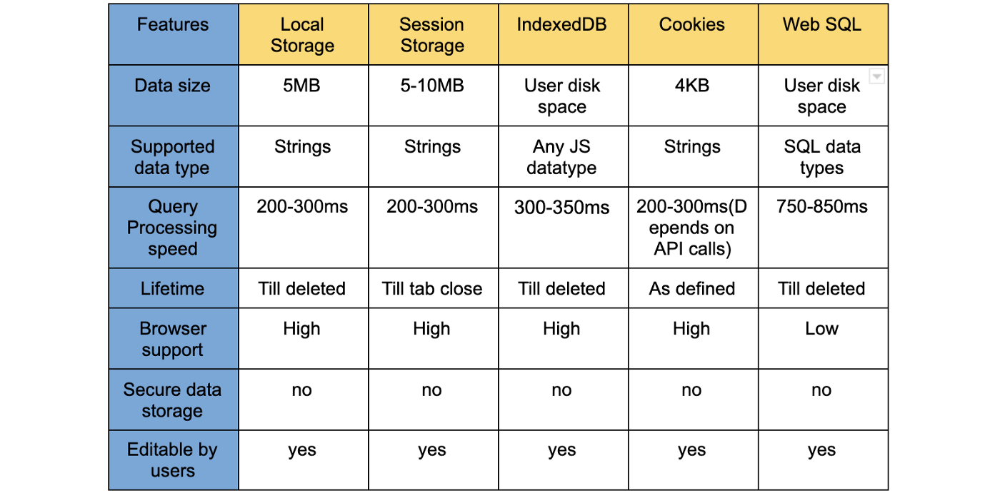
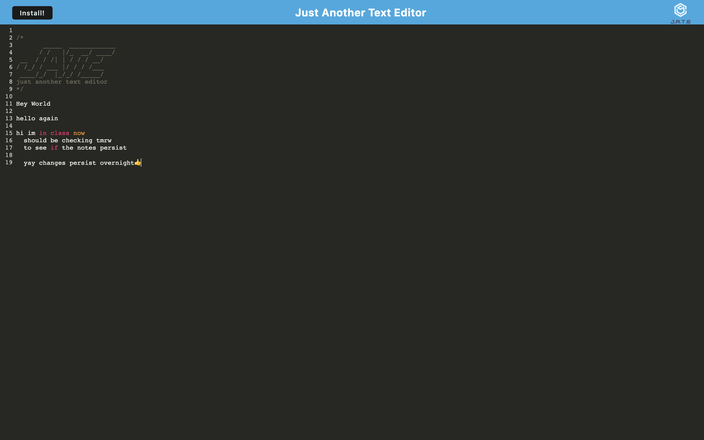

# text-eddy
Progressive text-editor web application


<br>

## 💡 Table of Contents

- [Description](#description-id)
- [New Tech Learned](#newtech-id)
- [Installation](#installation-id)
- [Usage](#usage-id)
- [Links](#links-id)
- [Screenshot](#screenshot-id)

<br>

> <strong>Deployed Heroku link: https://text-eddy-1.herokuapp.com</strong>

<br>

## <a id="description-id"></a>Description
This project was created to demonstrate the installation & application of *Webpack plug-ins* to create a *Progressive Web Application* in the form of a Text Editor (named 'Text Eddy'). WebPack plug-ins are npms that allow us to build modern applications using JavaScript objects installed here: https://webpack.js.org/concepts/plugins/. They are then linked to our projects by running the proper commands (see [Installation](#installation-id) steps). 

For this project, we want the user to be able to save their notes to their browser so that they their changes persist when leaving & returning to the text editor. For saving user data, we used *IndexDB*. Much like Local Storage, **IndexDB** saves user data inside the browser so it can be used when the user closes down & opens back up the page. The difference between the two is that IndexDB can save any & all types of JavaScript data while Local Storage can only store strings. IndexDB also allows us to use our applications offline. It's able to fetch queries even when there is no internet connection using *Service Workers*. **Service Workers** work in between the browser, our web app, & the network running internal functions that allow us to use applications offline & do nifty things like set up push notifications.

One final technology learned from this app was *Manifest*, a webpack plug-in that manages the bundling of our code & creates a connection between webpack & our code. **Manifest** handles the downloading of modules in our browser so we can save the application to our desktop. Set up in a webpack.config.js file, we have imported the webpack plug-in so that we can download the proper bundles necessary for setting up our application. Service workers are also imported in src-sw.js files.

### Storage Type Chart


<br>

## <a id="newtech-id"></a>WebDev Tech & Concepts Learned

```js
- Webpack & Webpack Plug-Ins
- IndexDB
- Service Workers
- Manifest Plug-In
```
> Links for these concepts can be found <a href="#links-id">below</a>

<br>

## <a id="installation-id"></a>Installation
To use this application, please click the link here:

> Install this app so it can be used locally & offline by clicking the <button> Install </button> at the top left corner of the page 

<br>

For downloading & building webpack plug-ins...
> Please follow the code snippets shown below. Feel free to **copy and paste**

<br>

```js
CLI Commands

- npm run start
- concurrently \"cd client && npm run build\" \"cd server && npm run server\"
- npm run build && cd server && node server.js
- cd server node server.js --ignore client
- cd client && npm run build
- cd server && npm i && cd ../client && npm i
- cd client && npm start
```

<br>

```js
package.json "scripts" object

"scripts": {
        "start:dev": "concurrently \"cd client && npm run build\" \"cd server && npm run server\" ",
        "start": "npm run build && cd server && node server.js",
        "server": "cd server node server.js --ignore client",
        "build": "cd client && npm run build",
        "install": "cd server && npm i && cd ../client && npm i",
        "client": "cd client && npm start"
    }
```

<br>

```js
Importing Webpack & Manifest in JavaScript

const HtmlWebpackPlugin = require('html-webpack-plugin');
const WebpackPwaManifest = require('webpack-pwa-manifest');
const path = require('path');
const { InjectManifest } = require('workbox-webpack-plugin');
```

<br>

```js
Importing Service Worker in JavaScript

const { offlineFallback, warmStrategyCache } = require('workbox-recipes');
const { CacheFirst } = require('workbox-strategies');
const { registerRoute } = require('workbox-routing');
const { CacheableResponsePlugin } = require('workbox-cacheable-response');
const { ExpirationPlugin } = require('workbox-expiration');
const { precacheAndRoute } = require('workbox-precaching/precacheAndRoute');
```

<br>

## <a id="usage-id"></a>Usage
Upon arriving to the site (https://text-eddy-1.herokuapp.com), you will see a basic text editor with name 'Jate' written in capital letters. Click anywhere in the text editor to begin typing, using all basic keyboard commands for input (<kbd>Enter</kbd> for new line, <kbd>Space</kbd> between letters, <kbd>Shift</kbd> for capital letters, etc). You may install onto your local machine by clicking the <button> Install </button> at the top left corner of the page. This will allow you to use the app offline. Your changes are also automatically saved with IndexDB. (<a href="https://developer.mozilla.org/en-US/docs/Web/API/IndexedDB_API" target="_blank">Learn More</a>)

<br>

## <a id="links-id"></a>Links
The author is a developer with a GitHub account: https://github.com/ScottsC0de & email: **Scott5902@gmail.com**<br>
<br>
Heroku link: https://text-eddy-1.herokuapp.com<hr>
GitHub project repo: https://github.com/ScottsC0de/text-eddy <hr>
WebPack: https://webpack.js.org/<hr>
IndexDB: https://developer.mozilla.org/en-US/docs/Web/API/IndexedDB_API<hr>
Manifest: https://webpack.js.org/concepts/manifest/<hr>
Service Workers: https://developer.mozilla.org/en-US/docs/Web/API/Service_Worker_API

<br>

## <a id="screenshot-id"></a>Screenshot
